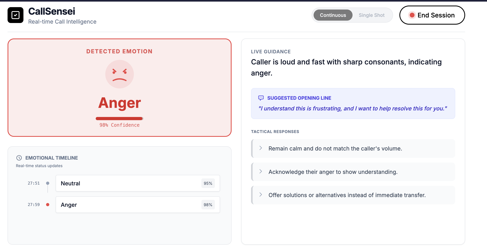

# CallSensei

CallSensei is a real-time call intelligence dashboard that provides live sentiment analysis, emotion detection, and strategic suggestions for call operators. This project was developed as part of the AI Hackathon SFxHamburg Coderabbit x Windsurf Christmas edition.

Built with React and powered by [Vapi](https://vapi.ai/), it analyzes voice conversations in real-time to help operators navigate calls more effectively.



## Features

- **Real-time Emotion Detection**: Visualizes the caller's current emotion and confidence level.
- **Live Transcription**: Displays a real-time transcript of the conversation.
- **Smart Suggestions**: Provides tactical bullet points and opening lines based on the call's context.
- **Emotion Timeline**: interactive chart showing the emotional trajectory of the call.
- **Two Operation Modes**:
  - **Continuous**: Analyzes the call continuously.
  - **Single Shot**: Analyzes a short segment and then stops (useful for spot-checking).

## Tech Stack

- **Frontend**: React 19, Vite, TypeScript
- **Styling**: Tailwind CSS
- **Voice/AI**: Vapi (Voice API), OpenAI (gpt-3.5-turbo via Vapi)
- **Visualization**: Recharts

## Prerequisites

- Node.js (v18 or higher)
- A Vapi Account and Public Key

## Installation

1. Clone the repository:

   ```bash
   git clone <repository-url>
   cd my-vue-app
   ```

2. Install dependencies:

   ```bash
   npm install
   ```

3. Configure Environment Variables:
   Create a `.env` or `.env.local` file in the root directory and add your Vapi Public Key:
   ```env
   VAPI_PUBLIC_KEY=your_vapi_public_key_here
   ```

## Running the App

Start the development server:

```bash
npm run dev
```

The application will be available at `http://localhost:3000`.

## Building for Production

To create a production build:

```bash
npm run build
```

The built assets will be in the `dist` directory.

## Project Structure

- `src/components`: UI components for the dashboard (EmotionBadge, Chart, Transcript, etc.)
- `src/hooks`: Custom hooks (useVapi for Vapi integration)
- `src/constants.ts`: System instructions for the AI model
- `src/types.ts`: TypeScript definitions
